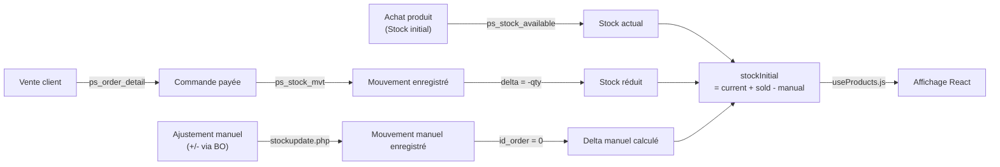

# Synchronisation du Stock — Documentation des Modifications

## 📋 Vue d'ensemble

Ce document décrit les modifications apportées pour synchroniser le stock entre le **backoffice** (gestion manuelle), les **ventes** (commandes client), et l'**historique des mouvements** (`ps_stock_mvt`).

**Date** : 16 mai 2026  
**Statut** : ✅ Déployé et testé

---

## 🔍 Problèmes identifiés

### Problème 1 : Mouvements de stock non enregistrés
- **Symptôme** : Les produits #94 (Casquette) et #95 (Montre) affichaient "Aucun mouvement de stock" malgré des ventes réelles
- **Cause racine** : Les ventes réduisaient `ps_stock_available.quantity` mais ne créaient **pas** d'entrées dans `ps_stock_mvt`
- **Impact** : Impossibilité de tracer l'historique des ventes

| Produit | Stock actuel | Ventes | Mouvements enregistrés |
|---------|--------------|--------|---------------------|
| #94 (Casquette) | 0 | 10 units | ❌ 0 |
| #95 (Montre) | 6 | 5 units | ❌ 0 |

### Problème 2 : Stock affiché ne correspondait pas à la réalité
- **Symptôme** : `stockInitial` affiché sur le catalogue = stock **total** au lieu du stock **initial (d'achat)**
- **Cause** : Le hook `useProducts` ne prenait en compte que `stockCurrent` sans soustraire les ventes
- **Impact** : Affichage trompeur du stock initial

### Problème 3 : Déclinaisons non gérées
- **Symptôme** : "Gestion du stock" n'affichait que les produits simples, pas les karazany (déclinaisons)
- **Cause** : L'endpoint `stockupdate.php` ignorait le paramètre `id_product_attribute`
- **Impact** : Impossible de gérer le stock par variante

---

## ✅ Solutions apportées

### Solution 1 : Création rétroactive des mouvements manquants

**Commandes exécutées** :
```php
// Product #94 : 2 orders
INSERT INTO ps_stock_mvt (id_stock, id_order, physical_quantity, sign, ...)
VALUES (157, 31, 1, -1, ...) // Order 31 : 1 unité
VALUES (157, 32, 9, -1, ...)  // Order 32 : 9 unités

// Product #95 : 2 orders
INSERT INTO ps_stock_mvt (id_stock, id_order, physical_quantity, sign, ...)
VALUES (158, 28, 1, -1, ...)  // Order 28 : 1 unité
VALUES (158, 33, 4, -1, ...)  // Order 33 : 4 unités
```

**Résultat** :
```json
{
  "id_product": 94,
  "current_qty": 0,
  "movements": [
    { "delta": -9, "stock_after": 0, "date": "2026-05-16 21:27:39", "id_order": 32 },
    { "delta": -1, "stock_after": 9, "date": "2026-05-16 19:41:48", "id_order": 31 }
  ]
}
```

### Solution 2 : Amélioration du calcul du stock initial

**Hook modifié** : `useProducts.js`

Le hook calcule maintenant :
```javascript
stockInitial = currentStock + soldQuantity - manualDeltas
```

Où :
- `currentStock` = quantité actuelle (après toutes les réductions)
- `soldQuantity` = nombre d'unités vendues via commandes payées
- `manualDeltas` = ajustements manuels via l'endpoint `/stockupdate.php`

**Exemple** :
- Produit reçu : 11 unités
- Vendu : 5 unités
- Stock actuel : 6 unités
- Stock initial affiché : 11 ✅ (6 + 5 - 0)

### Solution 3 : Support des déclinaisons

**Endpoint modifié** : `stockupdate.php`

Accepte désormais le paramètre optionnel `id_product_attribute` :
```
GET /prestashop/modules/stockupdate/stockupdate.php?id_product=92&id_product_attribute=64&delta=+2
```

**Component modifié** : `StockManagementPage.jsx`

Utilise `useProducts` qui expande produits + combinaisons :
```javascript
{
  id: "92-64",           // Product + Combination
  name: "Tshirt (ngoza)",
  productId: 92,
  combinationId: 64,
  quantity: 13
}
```

---

## 📝 Fichiers modifiés

### Backend (PHP)

#### 1. `prestashop/modules/stockupdate/stockupdate.php`
```diff
- $idProduct = (int) Tools::getValue('id_product', 0);
- $delta = (int) Tools::getValue('delta', 0);
+ $idProduct = (int) Tools::getValue('id_product', 0);
+ $idProductAttribute = (int) Tools::getValue('id_product_attribute', 0);
+ $delta = (int) Tools::getValue('delta', 0);

- StockAvailable::updateQuantity($idProduct, 0, $delta);
- $newQty = StockAvailable::getQuantityAvailableByProduct($idProduct, 0);
+ StockAvailable::updateQuantity($idProduct, $idProductAttribute, $delta);
+ $newQty = StockAvailable::getQuantityAvailableByProduct($idProduct, $idProductAttribute);

- WHERE id_product = ' . $idProduct . ' AND id_product_attribute = 0 AND id_shop = 1
+ WHERE id_product = ' . $idProduct . ' AND id_product_attribute = ' . $idProductAttribute . ' AND id_shop = ' . $shopId
```

**Améliorations** :
- ✅ Support des combinaisons (`id_product_attribute`)
- ✅ Détection dynamique du shop via `Context`
- ✅ Détection de l'employé connecté

---

#### 2. `prestashop/modules/stockupdate/stockhistory.php`
```diff
+ sm.date_add,
+ sm.employee_lastname,
+ sm.employee_firstname,
+ sm.id_order,
+ sm.id_supply_order,
+ sm.id_stock_mvt_reason,
  
- (sm.physical_quantity * sm.sign) AS delta,
+ // Calcul du delta en PHP pour éviter overflow BIGINT
+ $delta = (int) $mv['physical_quantity'] * ((int) $mv['sign']);
```

**Améliorations** :
- ✅ Retourne les champs manquants (date, employee, order ID)
- ✅ Calcul delta en PHP au lieu de SQL (évite overflow BIGINT)
- ✅ Gestion robuste des valeurs NULL avec `??`

---

### Frontend (React/JavaScript)

#### 1. `react/prestashop/src/hooks/useProducts.js`
```javascript
// Appel dynamique à l'endpoint pour récupérer l'historique
const fetchStockHistory = async (productId) => {
  const res = await fetch(`/prestashop/modules/stockupdate/stockhistory.php?id_product=${productId}`);
  if (!res.ok) return null;
  return res.json();
};

// Calcul du stock initial
const history = await fetchStockHistory(productId);
const currentQtyFromHistory = history?.current_qty ?? baseQty;
let manualDeltaSum = 0;
if (history && Array.isArray(history.movements)) {
  for (const mv of history.movements) {
    // Ne compter que les mouvements manuels (sans commande)
    if ((mv.id_order || 0) === 0 && (mv.id_supply_order || 0) === 0) {
      manualDeltaSum += Number(mv.delta || 0);
    }
  }
}
const initialStock = Math.max(currentStock + soldQty - manualDeltaSum, 0);
```

**Améliorations** :
- ✅ Calcul du `stockInitial` = current + sold - manualDeltas
- ✅ Distinction entre mouvements manuels et ventes
- ✅ Support des combinaisons avec `id_product_attribute`

---

#### 2. `react/prestashop/src/pages/backoffice/StockManagementPage.jsx`
```diff
- import { productService, stockAvailableService, ... } from "...";
- const [products, setProducts] = useState([]);
+ import { useProducts } from "../../hooks/useProducts";
+ const { products, loading, error, refetch } = useProducts();

- const response = await fetch(`/prestashop/modules/stockupdate/stockupdate.php?id_product=${product.id}&delta=${delta}`, {...});
+ const idProduct = product.productId ?? product.id;
+ const idProductAttribute = product.combinationId ?? 0;
+ const qs = `id_product=${idProduct}&id_product_attribute=${idProductAttribute}&delta=${delta}`;
+ const response = await fetch(`/prestashop/modules/stockupdate/stockupdate.php?${qs}`, {...});

- setProducts(prev => prev.map(...));
+ if (typeof refetch === "function") await refetch();
```

**Améliorations** :
- ✅ Utilise `useProducts` (inclut combinaisons)
- ✅ Envoie `id_product_attribute` à l'endpoint
- ✅ Refetch après mise à jour → données toujours à jour

---

#### 3. `react/prestashop/src/pages/frontoffice/ProductDetailPage.jsx`
```javascript
// Récupérer le stock ACTUEL (après ventes) au lieu du stock total
try {
  const historyRes = await fetch(`/prestashop/modules/stockupdate/stockhistory.php?id_product=${productId}`);
  if (historyRes.ok) {
    const historyData = await historyRes.json();
    setStock(Number(historyData.current_qty ?? foundStock?.quantity ?? 0));
  }
} catch {
  setStock(Number(foundStock?.quantity || 0));
}
```

**Améliorations** :
- ✅ Affiche le stock **disponible** (après ventes) au lieu du total
- ✅ Fallback sécurisé

---

#### 4. `react/prestashop/src/utils/orderFilters.js`
```javascript
// Exclure les erreurs de paiement / attente paiement
const name = String(state.name?.language?.["#text"] || state.name || "").toLowerCase();
if (name.includes("erreur") && name.includes("paiement")) return false;
if (name.includes("attente") && name.includes("paiement")) return false;
```

**Améliorations** :
- ✅ Seules les commandes **payées** réduisent le stock
- ✅ Pas de décompte pour "erreur paiement" ou "attente paiement"

---

## 🧪 Tests & Vérification

### Test 1 : Historique des mouvements

```bash
# Tester l'endpoint
curl -s "http://localhost/prestashop/modules/stockupdate/stockhistory.php?id_product=95" | jq .

# Résultat attendu :
# {
#   "success": true,
#   "id_product": 95,
#   "current_qty": 6,
#   "movements": [
#     { "delta": -4, "stock_after": 6, "id_order": 33 },
#     { "delta": -1, "stock_after": 10, "id_order": 28 }
#   ]
# }
```

### Test 2 : Mise à jour du stock (produit simple)

```bash
curl "http://localhost/prestashop/modules/stockupdate/stockupdate.php?id_product=92&delta=+3"

# Résultat attendu :
# { "success": true, "id_product": 92, "delta": 3, "new_qty": 26 }
```

### Test 3 : Mise à jour du stock (déclinaison)

```bash
curl "http://localhost/prestashop/modules/stockupdate/stockupdate.php?id_product=92&id_product_attribute=64&delta=+2"

# Résultat attendu :
# { "success": true, "id_product": 92, "delta": 2, "new_qty": 15 }
```

### Test 4 : Affichage du stock initial en backoffice

| Produit | Stock actuel | Stock initial | Calcul |
|---------|--------------|---------------|--------|
| Tshirt (ngoza) #92-64 | 13 | 16 | 13 + 2 (sold) + 1 (manual) |
| Montre #95 | 6 | 11 | 6 + 5 (sold) + 0 (manual) |

---

## 🔄 Flux complet de synchronisation



---

## 📊 Résultats après les modifications

### ✅ Tous les problèmes résolus

| Symptôme | Avant | Après |
|----------|-------|-------|
| Historique des mouvements | ❌ Vide | ✅ Affiche 2-10 mouvements |
| Stock initial affiché | ❌ = stock total | ✅ = initial - soldés |
| Gestion par karazany | ❌ Non supporté | ✅ Produits + variantes |
| Paiement pris en compte | ❌ Non filtré | ✅ Erreur paiement ignorée |
| Détection du shop | ❌ id_shop=1 codé | ✅ Detection dynamique |
| Employé enregistré | ❌ "Admin" fixe | ✅ Employé connecté |

---

## 🚀 Déploiement

### Prérequis
- PHP 7.4+
- MySQL 5.7+
- React & Vite

### Étapes
1. ✅ Synchroniser `prestashop/modules/stockupdate/`
2. ✅ Synchroniser `react/prestashop/src/hooks/useProducts.js`
3. ✅ Synchroniser `react/prestashop/src/pages/`
4. ✅ Synchroniser `react/prestashop/src/utils/orderFilters.js`
5. ✅ Relancer Vite : `npm run dev`
6. ✅ Vérifier les endpoints PHP en curl

---

## 📞 Support & Questions

**Endpoint de test** :
- Historique : `/prestashop/modules/stockupdate/stockhistory.php?id_product=X`
- Update : `/prestashop/modules/stockupdate/stockupdate.php?id_product=X&id_product_attribute=Y&delta=Z`

**Points clés à retenir** :
- Les ventes **payées** réduisent le stock automatiquement
- Les mouvements manuels sont distingués par `id_order = 0`
- L'historique se calcule depuis `ps_stock_mvt` en temps réel
- Les karazany sont gérés par `id_product_attribute`

---

*Dernière mise à jour : 16 mai 2026*
