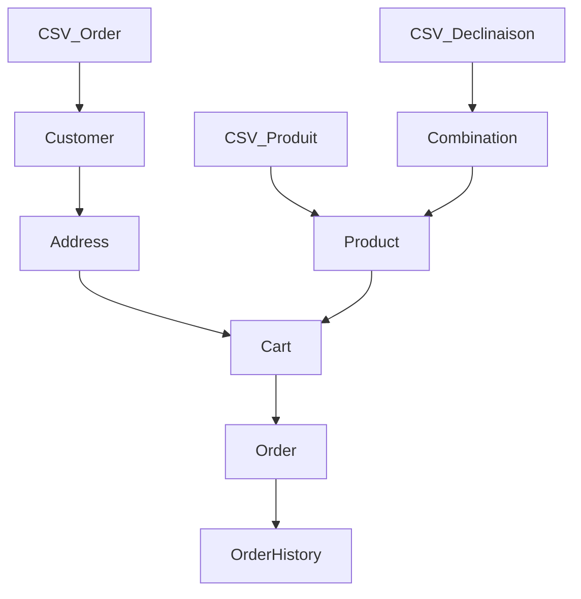

# Logique des Imports

Documentation technique sur le pipeline d'importation des données depuis les fichiers CSV/ZIP vers PrestaShop.

## Pipeline d'Importation Global
L'importation totale suit un ordre strict pour respecter les dépendances :
1.- **Reset** : Nettoyage via `resetService.js`.
- **Shop Context** : Toutes les ressources sont créées avec `id_shop: 1` et `id_shop_group: 1` par défaut pour garantir la visibilité WebService.
- **Produits** : Création des fiches de base.
3. **Images** : Association des médias aux produits.
4. **Déclinaisons** : Création des combinaisons et mise à jour des stocks.
5. **Clients & Commandes** : Création des comptes, adresses, paniers et commandes finales.

## 1. Import des Produits
- **API** : `POST /api/products`
- **Tables** : `ps_product`, `ps_product_lang`, `ps_category_product`.
- **Liaisons** :
    - `id_category_default` : Résolu via `findOrCreateCategory`.
    - `id_tax_rules_group` : Résolu selon le pourcentage de taxe fourni.
- **Logique** : Conversion `prix_ttc` + `Taxe` → `price` (HT) pour l'API.

## 2. Import des Déclinaisons (Combinaisons)
- **APIs** : `POST /api/combinations`, `POST /api/product_option_values`, `PUT /api/stock_availables`.
- **Tables** : `ps_combination`, `ps_product_option_value`, `ps_stock_available`.
- **Liaisons** :
    - Liaison au produit parent par `reference`.
    - Liaison au groupe d'attribut (Taille=1, Couleur=2, etc.) via `ATTR_GROUP_MAP`.
- **Logique** : Calcul de l'impact de prix (`prix_HT_declinaison - prix_HT_produit_parent`) et mise à jour du stock via `updateStockQuantity`.

## 3. Import des Clients & Commandes
C'est le module le plus complexe car il lie plusieurs ressources.
- **Séquence de création** :
    1. **Customer** (`ps_customer`) : Trouvé par email ou créé.
    2. **Address** (`ps_address`) : Créée et liée au client.
    3. **Cart** (`ps_cart`) : Créé avec les lignes de produits (`cart_rows`). Les références produits sont résolues en `id_product` et `id_product_attribute`.
    4. **Order** (`ps_orders`) : Créée à partir du panier.
    5. **Order History** (`ps_order_history`) : Créée pour forcer l'état (PrestaShop ignorant l'état au POST initial).

- **Liaisons de colonnes CSV** :
    - `achat` : Champ spécialisé `[("REF";QTY;"VAR")]` parsé par `parseAchatField`.
    - `etat` : Mapé vers les IDs PrestaShop (2: Accepté, 13: COD, 8: Erreur).

## Schéma Relationnel des Imports

